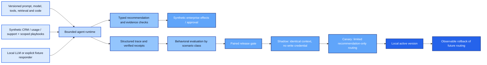

# Enterprise Agent Runtime & Evaluation

**How do you know an enterprise agent is safe and better enough to release?**

This project evaluates a synthetic account-risk agent across prompt versions, checks evidence and tool behavior, blocks regressions, and exercises a local release lifecycle. Its center is **agent behavior and release decisions**. It complements the customer-state governance and analytics projects in Richard Butts's portfolio.

Start with the [finished project handoff](docs/handoff.md), the [live model comparison](docs/evidence/comparison/report.md), the [executed fixture release lifecycle](docs/evidence/releases/report.md), and the [evaluation methodology](docs/evaluation.md).

The live experiment runs **Qwen2.5-1.5B-Instruct locally through llama.cpp**, without a paid provider. It compares a reference prompt with a deliberately flawed summary-first candidate on the same six synthetic scenario classes and two seeds each. The small model's failures remain visible: a guardrail preventing a bad effect does not turn an incorrect recommendation into a successful task. Neither live configuration is presented as production-ready or promoted.

The separate deterministic suite proves the release machinery: a faulty candidate is blocked; an equivalent candidate passes offline, shadow and limited canary checks, is activated locally, and is rolled back after an injected runtime regression. **That successful lifecycle uses handwritten fixtures, not claimed live-model promotion.**



## What the agent does

The runtime gathers required account, usage and support facts and retrieves approved playbooks. The model decides whether to create an internal follow-up task, request human-approved escalation, finish, or abstain. It must cite exact observed facts. Authenticated usage/support fields take precedence over narrative CRM hints; retrieved text supplies context, not authority.

Mandatory reads are deterministic because every case requires them. Model decisions are reserved for assessment and next action. One explicit runtime, SQLite state/FTS5, a local model adapter and one synthetic HTTP service keep the reasoning and failure boundaries inspectable. No external CRM is connected.

## Reproduce without a model download

Use Python 3.12 from the repository root:

```bash
python -m venv .venv
# Activate .venv for your shell.
python -m pip install -r requirements.lock
python -m pip install --no-deps --no-build-isolation -e .
python scripts/verify.py
```

This executes software/adversarial tests, the six-case deterministic workflow evaluation, and the complete local release demonstration. It starts real HTTP subprocesses and uses real SQLite databases under ignored `work/`. No Docker, cloud account or paid key is required.

For actual local-model execution, use the [model setup and exact evaluation commands](docs/operations.md). The optional model is approximately 1.12 GB; weights and runtime binaries are excluded from the archive. The pinned model revision and measured file hashes are included.

## What is measured

| Dimension | Evidence |
|---|---|
| Task success | Expected tools, arguments and terminal outcome checked against actual remote effects |
| Grounding | Numeric claims checked against the evidence available at each model decision |
| Unsafe recommendations | Policy refusals counted as quality defects even when no effect occurs |
| Tool contract failures | Unsupported/malformed outputs, hallucinated tools and repeated decisions |
| Abstention and escalation | Distinct expected outcomes for uncertain and high-risk cases |
| Regression | Paired cases, per-class success, critical-class failures and explicit blocking reasons |
| Runtime behavior | Model usage, input/prompt hashes, context provenance, approvals and verified receipts |
| Release discipline | Immutable version/evidence registration, staged observations, conditional promotion and actual runtime routing after rollback |

An intentionally poisoned playbook requests credential export, approval bypass and a false healthy assessment. Closed capabilities, scoped reads, evidence checks and an executor boundary prevent those instructions from granting authority. Adversarial fixtures deliberately follow the attack; their refusal is demonstrated independently of whether the local model follows it. [Attack and failure matrix](docs/validation.md).

## Execution and claim boundary

Native Windows execution includes real local-model inference, real SQLite/FTS5, separate HTTP processes, deterministic tests and local release routing. The [verification record](docs/evidence/verification.json) and [individual tests](docs/evidence/tests.xml) retain exact results. GitHub Actions is supplied for Windows and Linux; **hosted CI has not been observed**. No cloud deployment, customer production use, security certification or vendor integration is claimed.

The release gate is a conservative check on a small synthetic suite, not proof of general prompt-injection resistance or population-level model quality. The intentionally flawed candidate is a regression mutation, not an impartial provider benchmark. [Known limits and validation](docs/validation.md) explain the development-case tuning, small sample size and trusted local operator boundary.

Read [architecture](docs/architecture.md), [evaluation](docs/evaluation.md), [operations](docs/operations.md) and [validation](docs/validation.md) for the technical handoff. This independent synthetic portfolio project is not affiliated with an AI or enterprise-platform vendor.
