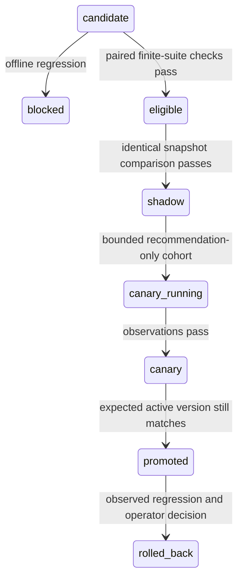

# Runtime and release architecture

The engineering problem is deciding whether observed agent behavior justifies a release. The runtime exists to produce meaningful evidence: context, structured decisions, policy outcomes, tools, receipts and final results. It does not rebuild a canonical CRM or customer-consent platform.

## One small enterprise scenario

A fictional B2B account has three authenticated numeric facts: renewal horizon, active usage percentage and critical support-ticket count. CRM also exposes a narrative health hint that can disagree with usage and support. SQLite FTS5 retrieves up to two tenant-scoped, approved playbooks by the relevant topic. Drafts and another tenant's documents are excluded before model context construction. Each document retains its ID, revision, content and content hash.

Mandatory reads are collected deterministically. Making a small model repeatedly choose four required reads added failure opportunities without useful discretion. The model instead chooses the next business operation: create a follow-up task, request an escalation, finish or abstain. This is genuine model inference in live mode. Eligibility checks, approval and evidence validation remain deterministic.

The provider-facing contract has one operation field and atomic fact references. An adapter converts it into the internal typed decision. This removes redundant fields that allowed contradictory output such as “call” with no tool. Unsupported operations, malformed values, invented facts and incompatible evidence fail closed. Grammar-constrained decoding is part of the evaluated system; it is not presented as the model independently learning the tool allow-list.

## State and capability boundaries

`Store` persists runs, context, decisions, attempt budgets, proposed effects and append-only traces. SQLite uses WAL, full synchronization, foreign keys and short transactions. A per-run lease coordinates workers and fences stale updates. Model requests consume a durable call allowance before HTTP. Neither a model request nor an enterprise HTTP call runs inside a local database transaction.

The enterprise service is a separate process and database. Its read credential cannot create effects. Model inputs contain no service credential. The executor derives tenant, account, version vector and effect key from trusted run state, not model-supplied identifiers. A human escalation requires an exact action hash, reviewer identity, policy binding and expiry. The CLI/harness is a trusted local operator boundary; there is no claim of deployed enterprise identity or tenant administration.

The synthetic service atomically checks the source revision vector and inserts an effect under a unique key. A changed context rejects the write. Recovery queries the original key before resending and verifies the returned payload/hash. Delivery is at least once with an idempotent synthetic effect contract, not distributed exactly once. This contract requires cooperation from any future real adapter.

There are at most nine model requests, a ten-minute run lifetime, bounded model output, repeated-decision detection, bounded read/effect retries and context/approval expiry. A blocked or exhausted run can retain a pending uncertain action; it must not be interpreted as proof that the remote system never committed. The runtime is deliberately small and single-host; a file owner can alter the database or code.

## Version and release identity

`configuration()` fingerprints the prompt, model artifact/revision, runtime release, decoding settings, tool schema, policy, retrieval settings and Python implementation. The corpus is defined in the versioned synthetic-service source and appears in per-run provenance. Evidence records the dataset plus expected-outcome hash, version fingerprint, prompt hash, structured provider outputs and observed token usage. An ID cannot silently be re-registered with different configuration.

The registry stores evidence bodies and an append-only release history. Candidate evaluation must use the current active baseline. A candidate must pass paired offline checks before shadow observation, then start a restricted canary, then pass canary observation before promotion. Promotion checks the expected active version again to prevent stale-baseline activation.

Shadow compares the first meaningful recommendation on identical frozen context, not the full downstream workflow. It supplies no write credential and stops at a non-authoritative recommendation. Candidate/base decisions are compared structurally, with claim-order normalization. Canary routing uses 20 of 100 stable hash buckets and admits only healthy/adoption classes; the selected runtime is forced into shadow mode. It is a local recommendation canary, not a production traffic experiment.

`routed_run()` connects registry choice to actual model/runtime instantiation. Promotion and rollback therefore change the configuration used by subsequent runs. The generated lifecycle includes traces before and after rollback. Rollback never pretends to reverse completed business effects.

## Deliberate omissions

SQLite is sufficient for the bounded, single-host state and search problem. PostgreSQL, brokers, distributed workers and orchestration services would shift complexity away from evaluation without improving this demonstration. A vector database is unnecessary for three small topic-indexed playbooks; exact retrieval scope and provenance matter more here than semantic search scale. No MCP or agent framework is needed for a fixed capability set with direct HTTP contracts. A single agent avoids artificial coordination problems. These choices are scope decisions, not claims that those technologies lack value in larger systems.
